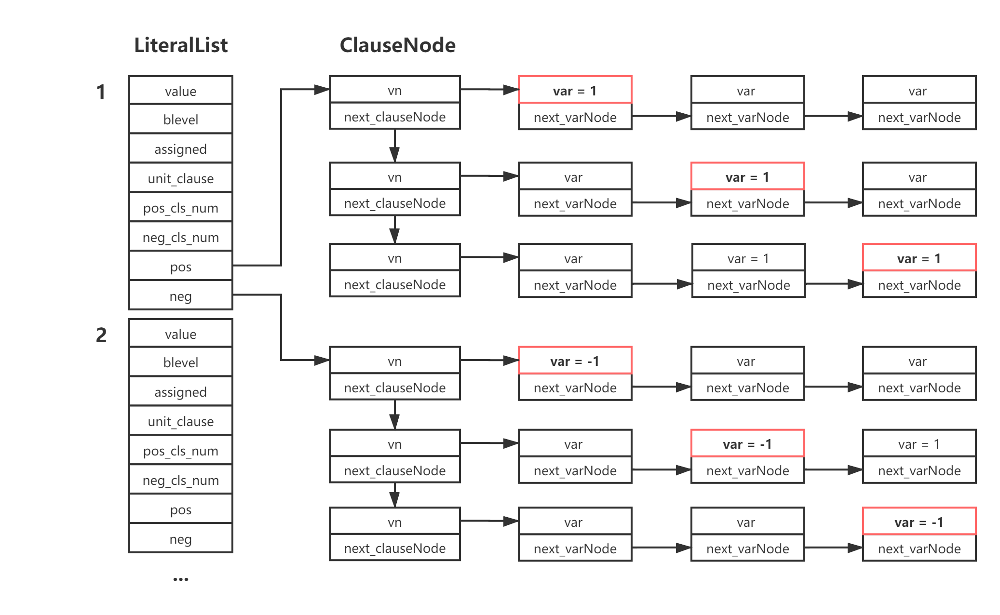

# DPLL-SAT-Solver
Program synthesis design practice  
基于DPLL算法的SAT求解器，以及二进制数独  
## 相关常量定义
```c
/*常量定义*/
//变元相关
#define TRUE 1           //变元为真
#define FALSE -1         //变元为假
#define UNKNOWN 0        //变元未赋值
#define NONE 2           //变元不存在
#define Max_Ltr_Num 4000 //最大文字数
//范式相关
#define SATISFIABLE 1   //可满足
#define UNSATISFIABLE 0 //不可满足
#define CONFLICT 0      //存在冲突
#define OTHERS 2        //其他情况
#define UNIT -1         //单子句
```
## 数据结构
文字邻接表，以数组形式存储全部文字结构，每个文字结构包括该文字相关信息，以及正文字和负文字分别指向对应变元出现过的子句链。  
* value：文字的值，TRUE/FALSE/UNKNOWN/NONE
* blevel：文字的决策级，推断出的文字决策级与对应层相等
* assigned：文字被赋值次数，用于回溯时检查，被赋值两次就需向上一层回溯
* unit_clause：文字的推断标记，被推断出来的标记为1，决策变元为0
* pos_cls_num：正文字相关子句数量，用于VSIDS分支选择策略
* neg_cls_num：负文字相关子句数量，用于VSIDS分支选择策略
* pos：正文字相关子句指针
* neg：负文字相关子句指针

数据结构示意图：

数据结构具体定义：
```c
/*数据结构定义*/
//变元结点定义
typedef struct varNode
{
    int var;                      //变元
    struct varNode *next_varNode; //指向下一个变元结点
} VarNode;

//子句结点定义
typedef struct clauseNode
{
    VarNode *vn;                        //指向变元结点
    struct clauseNode *next_clauseNode; //指向下一个子句结点
} ClauseNode;

//文字邻接表定义
typedef struct literalList
{
    int value;       //TRUE/FALSE/UNKNOWN/NONE
    int blevel;      //赋值时的决策级
    int assigned;    //被赋值的次数
    int unit_clause; //标记该文字是否是被推导出来的
    int pos_cls_num; //正文字相关子句数量
    int neg_cls_num; //负文字相关子句数量
    ClauseNode *pos; //正文字邻接表
    ClauseNode *neg; //负文字邻接表
} LiteralList;
```
